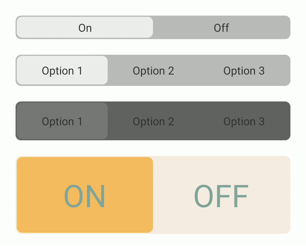

# react-native-multiple-switch

[](https://badge.fury.io/js/react-native-multiple-switch)
[](https://img.shields.io/npm/dt/react-native-multiple-switch)


Device Information for [React Native](https://github.com/facebook/react-native).

## Install

Using npm:

```Shell
npm i react-native-multiple-switch
```

or using yarn:

```Shell
yarn add react-native-multiple-switch
```

## Usage

```javascript
import MultiSwitch from 'react-native-multiple-switch'

export const App = () => {
  const items = [
    {
      displayName: 'Option 1'
      uniqueId: '1',
      value: {...complexObject},
    },
    {
      displayName: 'Option 2'
      uniqueId: '2',
      value: {...complexObject},
    },
  ]
  const [value, setValue] = useState(items[0])

  return (
    <MultiSwitch<boolean>
      items={items}
      value={value}
      onChange={(val) => setValue(val)}
    />
  )
}
```

## Types
Some custom types are defined and exported which are used in the props.

### MultipleSwitchItem<D extends any>
`D` is a generic type which will allow the items to have a more complex type as their value.

| Name        | Type        | Default | Required |
| ----------- | ----------- | ------- | -------- |
| displayName | string      |         | true     |
| uniqueId    | string      |         | true     |
| value       | D (generic) |         | true     |

### Colors
| Name                             | Type   | Default | Required |
| -------------------------------- | ------ | ------- | -------- |
| containerBackgroundColor         | string | #BBBBBB | true     |
| containerBackgroundDisabledColor | string | #636363 | true     |
| sliderColor                      | string | #EEEEEE | true     |
| sliderDisabledColor              | string | #787878 | true     |
| textColor                        | string | #333333 | true     |
| activeTextColor                  | string | #333333 | true     |

### SliderAnimationConfig

| Name                 | Type   | Default | Required |
| -------------------- | ------ | ------- | -------- |
| slidingDurationMs    | number | 200     | false    |
| opacityDurationMs    | number | 100     | false    |
| opacityStartingValue | number | 0.45    | false    |


## Props<D extends any>
`D` is a generic type which will allow the items to have a more complex type as their value.

| Prop                  | Type                                   | Default | Required |
| --------------------- | -------------------------------------- | ------- | -------- |
| items                 | MultipleSwitchItem<D>[]                |         | true     |
| value                 | string                                 |         | true     |
| onChange              | (value: MultipleSwitchItem<D>) => void |         | true     |
| disabled              | boolean                                | false   | false    |
| mediumHeight          | boolean                                | false   | false    |
| bigHeight             | boolean                                | false   | false    |
| containerStyle        | ViewStyle                              | {}      | false    |
| sliderStyle           | ViewStyle                              | {}      | false    |
| textStyle             | TextStyle                              | {}      | false    |
| activeTextStyle       | TextStyle                              | {}      | false    |
| colorOverrides        | Colors                                 | {}      | false    |
| sliderAnimationConfig | SliderAnimationConfig                  | {}      | false    |

## Examples



```javascript
<MultipleSwitch
  items={items}
  value={value}
  onChange={(val) => setValue(val)}
/>

// Medium height
<MultipleSwitch
  items={items}
  value={value}
  onChange={(val) => setValue(val)}
  mediumHeight
/>

// Big height and disabled
<MultipleSwitch
  items={items}
  value={value}
  onChange={(val) => setValue(val)}
  bigHeight
  disabled
/>

// Custom styles
<MultipleSwitch
  items={items}
  value={value}
  onChange={(val) => setValue(val)}
  containerStyle={{
    backgroundColor: '#f7ede2',
    height: 100
  }}
  sliderStyle={{
    backgroundColor: '#f6bd60'
  }}
  textStyle={{
    color: '#84a59d',
    textTransform: 'uppercase',
    fontSize: 40,
  }}
/>

// Custom colors
<MultipleSwitch
  items={items}
  value={value}
  onChange={(val) => setValue(val)}
  colorOverrides={{
    containerBackgroundColor: '#FFFFFF',
    containerBackgroundDisabledColor: '#575757',
    sliderColor: '#00FF00',
    sliderDisabledColor: '#CDF1CD',
    textColor: '#000000',
    activeTextColor: '#0000FF',
  }}
/>

// Custom animation settings
<MultipleSwitch
  items={items}
  value={value}
  onChange={(val) => setValue(val)}
  sliderAnimationConfig={{
    slidingDurationMs: 1000,
    opacityDurationMs: 200,
    opacityStartingValue: 0.65,
  }}
/>
```

## Contribute

If you would like to contribute to react-native-multiple-switch:

1. Add a [GitHub Star](https://github.com/alejandrocortell/react-native-multiple-switch) to the project (that help a lot!).
2. Determine whether you're raising a bug, feature request or question.
3. Raise your issue or PR.

## License

The code is available under the [MIT license](LICENSE.txt).
